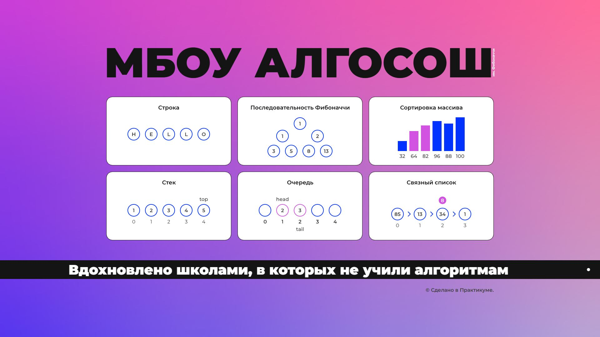

# Проект "МБОУ АЛГОСОШ" – Визуализатор алгоритмов

## О проекте

Интерактивное SPA-приложение для визуализации популярных алгоритмов и структур данных. Проект создан в рамках курса **"Веб-разработчик +"**, направлен на закрепление знаний по алгоритмам, типизации и разработке UI с анимацией.

Цель — наглядно продемонстрировать работу алгоритмов, упростить их понимание и закрепление логики выполнения.

## Превью проекта



## Ссылка на демо

- [Посмотреть приложение](https://algososh-qki4.vercel.app/)

## Статус проекта

✅ Проект завершён

## Функциональность

- 🔁 Визуализация **разворота строки**
- 🌀 Построение последовательности **Фибоначчи**
- 🔢 Сортировка массива: **пузырьком** и **выбором**
- 📦 Работа со структурами:
  - **Стек**
  - **Очередь**
  - **Связанный список**
- 🧪 Тестирование:
  - **Unit-тесты** (Jest)
  - **E2E-тесты** (Cypress)
- ⚡ Анимация шагов выполнения алгоритмов

## Технологии и инструменты

- **React** — библиотека для построения UI
- **TypeScript** — типизация кода
- **React Hooks** — управление состоянием и жизненным циклом
- **HTML5 / CSS3 / Flexbox**
- **Jest** — unit-тестирование
- **Cypress** — end-to-end тесты
- **Алгоритмы и структуры данных**
- **Yarn** — управление зависимостями и запуск

## Установка и запуск

1. Клонировать репозиторий:

   ```bash
   git clone https://github.com/kirill-io/algososh.git
   ```

2. Перейдите в директорию проекта:

   ```bash
   cd algososh

   ```

3. Установите зависимости:

   ```bash
   yarn

   ```

4. Запуск в режиме разработки:

   ```bash
   yarn start

   ```

5. Сборка проекта:

   ```bash
   yarn build

   ```

6. Запуск тестов:

- Unit-тесты:

```bash
 yarn test:jest

```

- E2E (в интерфейсе):

```bash
 yarn test:cypress-open

```

- E2E (в терминале):

```bash
 yarn test:cypress-run

```

- Запуска Cypress (в интерфейсе):

```bash
 yarn cypress:open

```

- Запуска Cypress (в терминале):

```bash
 npm run cypress:run

```
